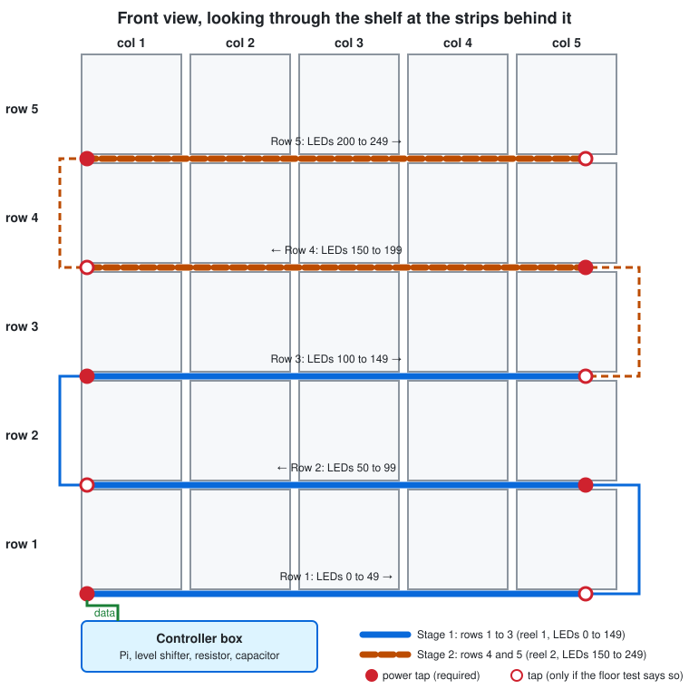
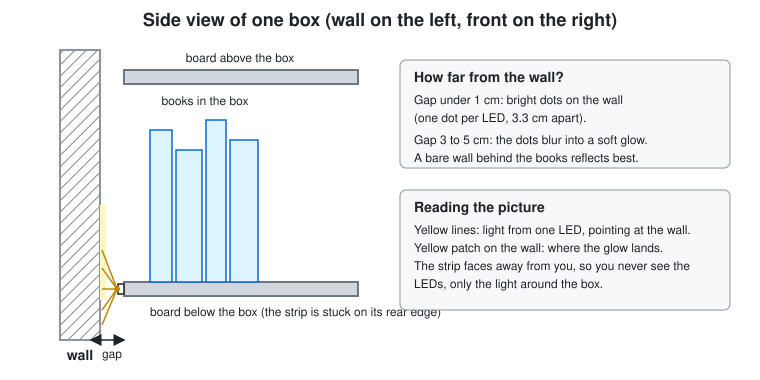
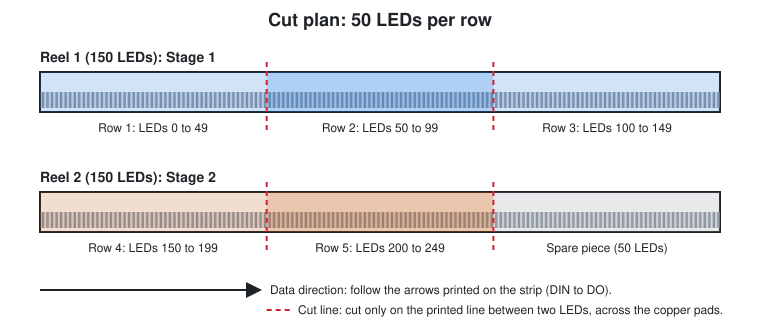

# 2. Plan your layout

Before you buy wire or cut anything, decide where every strip goes, how long each piece is, and how much power it needs. This step is measuring and arithmetic. Nothing is plugged in yet.

## What you need

- Tape measure, pencil, paper
- Your shelf, standing where it will live (or its exact position marked)
- The [glossary](GLOSSARY.md) if a word is new
- A calculator (the phone one is fine)

## 2.1 Measure the shelf

Fill in the **Your value** column. The **Example** column shows what a standard Kallax should roughly give, so you can spot a measuring mistake. Treat the examples as hints only: **VERIFY by measuring**, because I couldn't confirm every dimension for your unit.

| What | How to measure | Example | Your value |
|---|---|---|---|
| **W**: inside width of one box | Between two vertical dividers | about 33 cm (IKEA's inserts for Kallax are 33 cm wide) | |
| **P**: box pitch | Left face of one divider to the left face of the next | about 35 cm | |
| **H**: inside height of one box | Between two horizontal boards | about 33 cm | |
| **D**: depth | Front edge to rear edge of a board | about 39 cm | |
| **T**: thickness of the rear edge of a board | Look at the rear edge from behind or below. How wide is the flat face? | **unknown**: measure | |
| Rear edge finish | Bare board, plastic edge, paper foil, rough? | | |
| **G**: gap between wall and the shelf | Slide a ruler behind the unit | 0 to a few cm (skirting board?) | |
| Shelf width and height | Outside, whole unit | about 182 cm each for a 5 × 5 (**VERIFY**) | |
| Floor to the underside of the bottom board | | | |
| Shelf to the nearest wall socket | | | |
| Where the controller box will live | See [2.8](#28-where-the-controller-and-power-supplies-go) | | |

Why T matters: the strip is about 10 mm wide (**VERIFY**, see the strip's label). If the flat rear edge of a board is narrower than that, a strip stuck on it will overhang, so you have to use the mounting positions in [2.4](#24-will-the-glow-look-good) that don't rely on the rear edge.

## 2.2 Decide how the strip runs

There are three sensible ways to run a strip through a shelf:

| Option | What it means | Joints | Verdict |
|---|---|---|---|
| **A. Row strips in one chain** | One strip piece per row, running along a horizontal board across all five boxes. The pieces are connected end to end by short wires, bottom to top, in a zig-zag. | Few: 1 data wire per row change (4 for 5 rows) | **Recommended for you** |
| B. One strip piece per box | 25 short pieces. | About 50 | Too many joints for a first build |
| C. One long strip that snakes through every box edge | One continuous strip, zig-zagging up and down. | Almost none, but it needs 90° bends | The strip can't bend flat around a corner; you'd have to cut and re-join at each corner anyway. |

Row strips (option A) win because the strip is stuck in a straight line, you only have to join strips at the row ends, and the app does not care: it only knows LED **numbers**, not where they sit.

Electrically it is still **one chain**: the Pi's data wire goes into the start of row 1, out of the end of row 1 into the start of row 2, and so on. Row 1 is the bottom row.

*Figure 2.1: The plan, as seen from the front, with the shelf made see-through so the strips behind it show.*

## 2.3 How many LEDs per box

Your strip has 30 LEDs per metre, so one LED every 3.33 cm.

- A box is about 33 cm wide: **about 10 LEDs per box** along one edge.
- A row of 5 boxes is about 175 cm wide, so about 52 LEDs per row.
- **A piece of 50 LEDs is 1.67 m long**, so it just fits a row with a few cm to spare at the end. And a 150-LED reel cuts into exactly three pieces of 50. That is why the guide uses 50.

Total: 5 rows × 50 = **250 LEDs = two reels** (with one 50-LED piece left over).

The LEDs don't line up exactly with the boxes, so each box ends up with **8 to 11 LEDs**. That is fine: the app lets every box have its own list. See [step 7](07-map-leds-to-boxes.md).

### The two stages

| | LEDs | Software |
|---|---|---|
| **Stage 1** | rows 1 to 3 = 150 LEDs = **reel 1, numbers 0 to 149** | Works with the app as it is today (it supports exactly 150 LEDs). |
| **Stage 2** | rows 4 and 5 = 100 LEDs = **reel 2, numbers 150 to 249** | Needs the app's LED count raised (not part of this guide). |

If you'd rather build all five rows at once, do that, but rows 4 and 5 won't light until the software supports it.

## 2.4 Will the glow look good?

Your idea: stick the strip to the back edge of a board so the LEDs face the wall, hidden from the front, and the light bounces off the wall to make a soft halo around the box. Because your shelf has no back panel, this is physically possible. Here is an honest look at it.

**It can look good if:**
- The wall behind is **light and matt** (white or pale paint). A dark wall soaks up most of the light.
- There is a **gap of roughly 3 to 5 cm** between the strip and the wall. With the shelf flat against the wall the strip is only a few millimetres from it, and you see one bright dot per LED instead of a soft glow (Figure 2.2).
- You look at it in a **dim room**. In daylight a halo from 8 to 11 LEDs is faint.

**Things that can go wrong:**
- **Books hide it.** If a box is packed full, books block light from escaping above and beside them. You'd see only a thin glow around the shelf's edges.
- **Two boxes share every horizontal board.** The glow on a board's rear edge lights up between the box above and the box below. This guide's rule: **a strip lights the box above it** (the strip is stuck on the board *under* the box). Top-row boxes use the strip on the board under them, and nothing is stuck on the very top board.
- **Vertical dividers are not used.** A strip on a vertical divider would belong to the two boxes either side, so you couldn't highlight just one.
- **No wall gap and no anchoring:** pulling a tall loaded shelf away from the wall makes it easier to tip. See the safety notes at the end of this step.

*Figure 2.2: Side view of one box. The strip faces the wall; the gap decides whether you get dots or a soft glow.*

### Alternatives if the glow is too faint

The electronics and the strip pieces are identical for all of these. Only *where you stick the strip* changes, and you decide in [step 6](06-mount-on-the-shelf.md) with a 30-minute mock-up using painter's tape.

| Position | Where | Good | Bad |
|---|---|---|---|
| **A. Rear edge** (default) | On the rear edge of the board, facing the wall | Hidden LEDs, no glare | Glow depends on the wall gap and the books |
| **B. Inside, near the back** | Under the board above the box, close to the rear, facing down | Lights the books and the wall; each box owns its strip | LED dots can show from an angle |
| **C. Front edge, in a diffuser channel** | Aluminium channel with an opal cover under the front of the board above | Brightest and clearest | You see the channel; costs more; adds depth |
| D. Mixture | A (halo) plus a short front-lit highlight | Best of both | More parts and wiring |

Strong brightness is not the goal; a quiet, readable "this box" signal is.

## 2.5 The cut list

Cut at the printed cut lines only, between two LEDs (see [step 5](05-cut-and-join.md)).

| Piece | Reel | LED numbers | LEDs | Length | Runs | Stage |
|---|---|---|---|---|---|---|
| Row 1 (bottom) | 1 | 0 to 49 | 50 | 1.67 m | left to right | 1 |
| Row 2 | 1 | 50 to 99 | 50 | 1.67 m | right to left | 1 |
| Row 3 | 1 | 100 to 149 | 50 | 1.67 m | left to right | 1 |
| Row 4 | 2 | 150 to 199 | 50 | 1.67 m | right to left | 2 |
| Row 5 (top) | 2 | 200 to 249 | 50 | 1.67 m | left to right | 2 |
| Spare | 2 | none | 50 | 1.67 m | | keep for repairs |

*Figure 2.3: Cutting the two reels.*

Every piece must be stuck down **in the data direction of the chain**: the arrow printed on the strip points the way the data flows, and it has to point from row 1's start toward row 1's end, then row 2's start (on the opposite side), and so on.

## 2.6 Power budget

### The numbers

- One LED at full white takes about **60 mA** (**VERIFY** on the strip's label or datasheet). Red, green or blue alone is about a third of that.
- Idle (everything off) it still draws about 1 mA each (**VERIFY**).
- Power = LEDs × 0.06 A. At 5 V.

| Zone | Rows | LEDs | Worst case (all white) | Idle | Supply you need |
|---|---|---|---|---|---|
| Stage 1 | 1 to 3 | 150 | 150 × 0.06 = **9 A** (45 W) | about 0.15 A | 5 V, **10 A** |
| Stage 2 | 4 and 5 | 100 | 100 × 0.06 = **6 A** (30 W) | about 0.1 A | 5 V, **6 A or more** (10 A for the same model as stage 1) |

### What this means in daily use

- Highlighting one box lights about 10 LEDs: at most **0.6 A**.
- A solid single colour on every LED: about a third of the worst case.
- **All LEDs at full white** is the worst case. The app has **no brightness limit**, so a white `solid` scene is full power. A 10 A supply feeding 150 LEDs at full white is at 90 % load: it works but runs warm. **Don't leave it on.** If you stay on colours and highlights, you will never get close.

### Power injection: feeding each row separately

A long strip is a long, thin copper track. As current flows, the voltage falls along it, so the far end gets less than 5 V and white turns yellow-red. To avoid that, **feed power into the start of every row** (a *tap*). Each row is 50 LEDs, and a row's own supply path is short.

- **Required:** a tap (+5 V and ground) at the **start** of every row.
- **Optional:** a second tap at the **end** of the row. Measure in [step 4](04-floor-test.md) to see if you need it.
- The data wire between rows carries **data and ground only**. Each row gets its own +5 V from the rail, so don't connect +5 V from one row's end to the next row's start.
- **Never connect the +5 V of two different supplies together.** Zone 1 and zone 2 each have their own supply; **only their grounds are joined**. See the wiring in [step 3](03-bench-build.md).

### Wire sizes and fuses

Guideline (**VERIFY** against your wire's and fuse's own ratings):
- Supply to rail (up to 9 A): **16 AWG** (1.5 mm²), as short as you can, under 1.5 m per run.
- Rail to each row tap (about 3 A): **18 AWG** (1 mm²).
- Data and jumpers (a few mA): **22 AWG**.
- One inline fuse right after each supply, rated a little above the zone's worst case (e.g. 10 A for the 9 A zone) and **never above the rating of the thinnest wire it protects**.

### Alternative: one small supply per row

Five 5 V, 4 A enclosed supplies (3 A per row at full white) remove the shared rails. Each row's tap goes straight to its own supply. Everything else stays the same, and it's simpler. The cost is five bricks to hide. If you choose this, wherever the guide says "rail", read "that row's supply", and still join all the grounds.

## 2.7 Cable lengths worksheet

Fill these in with the tape measure; they decide how much wire you buy.

| Run | Rule of thumb | Your length |
|---|---|---|
| Controller to the start of row 1 (data + ground) | As short as possible. Up to about 0.5 m is fine (**VERIFY** by testing: a short data wire is the safest). | |
| Row-to-row jumper (one per row change, 4 in total) | About one box pitch (35 cm) up, plus about 10 cm slack | |
| Supply 1 to the rail (+ and −) | | |
| Rail up the side of the shelf | The shelf height (about 1.8 m), once on each side if you tap both ends | |
| Rail to each row tap | About 0.3 m each | |
| Mains cable to the wall | Whatever the supply comes with, plus a power strip | |

Add 15 % to every length and round up.

## 2.8 Where the controller and power supplies go

The controller is the Pi, the level shifter, the resistor and the capacitor, together in one small box. Choose one:

| Place | Good | Bad |
|---|---|---|
| **Floor, beside the bottom-left corner of the shelf** (default) | Shortest data wire to row 1; easy to reach | Visible unless hidden behind a plant or curtain |
| **In the gap behind the shelf** | Invisible | Needs a gap bigger than the Pi's box (about 3 cm for a bare board with no case; **VERIFY**); hard to service; keep air flowing |
| In one box with a door insert | Invisible | Costs you one box |

Never wrap the Pi or a power supply tightly: they need air.

## 2.9 Safety before you go on

- **Wall anchoring.** A tall Kallax full of books can tip, and pulling it forward from the wall makes that more likely. You said you don't want to drill, so this guide doesn't use screws. IKEA supplies anti-tip fittings for tall units. If a child or pet could pull on the shelf, anchor it. This is your decision.
- Removing the back panel makes the unit less rigid. Check that the shelf doesn't wobble sideways under load.

## How to check it worked

- Every cell of the measuring table is filled in.
- You can say, for each row, which end the data enters and which LED numbers it has.
- You know the amps for each zone and have bought (or chosen) the supplies and fuses to match.
- You have a list of wire lengths.

## Common mistakes

- Using the **box width** in LEDs rather than the **row**: a row is 5 boxes plus 4 dividers, and the strip is continuous across the dividers.
- Forgetting that supply and wire sizes depend on **full white**, because the app has no brightness limit.
- Planning a +5 V connection between zone 1 and zone 2.
- Measuring "left" and "right" from behind the shelf.

Next: [3. Bench build](03-bench-build.md)
