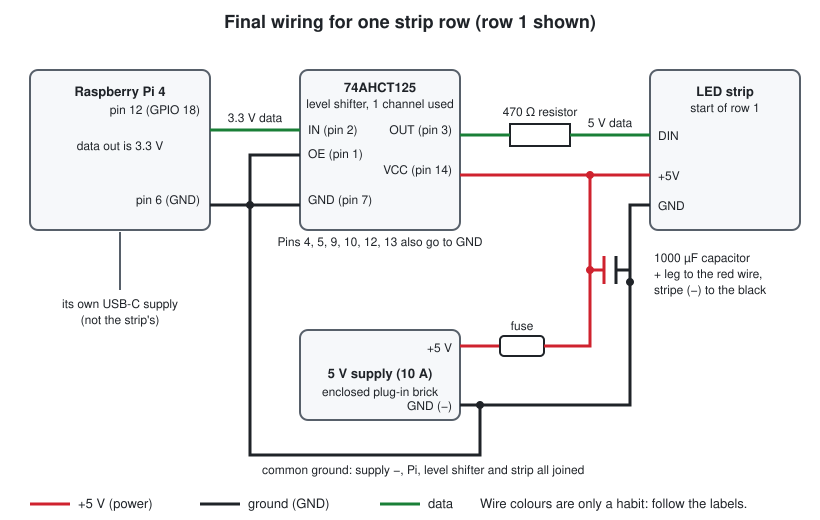
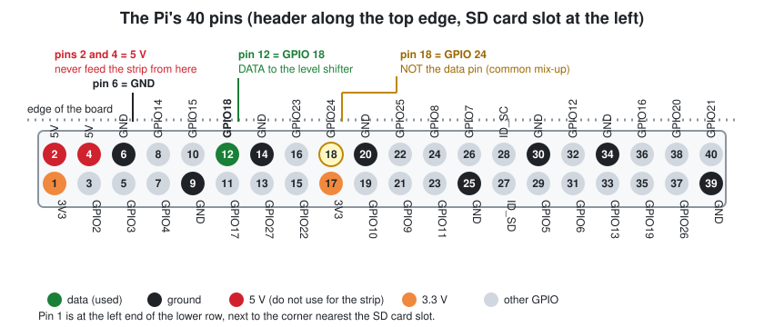
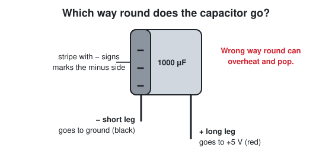
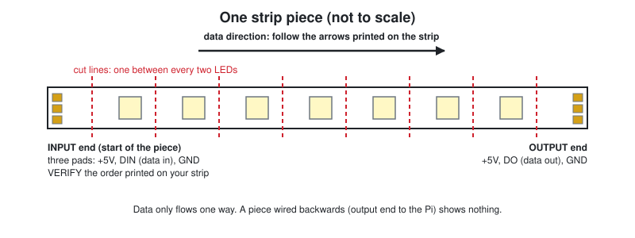

# 3. Bench build

Wire up everything on a table: the Pi, a level shifter, a resistor, a capacitor, the power supply and the strip. You have already lit a strip through a breadboard; this redoes it with all the protective parts and a proper supply, so you can trust it before any of it goes on the shelf.

## What you need

- The Pi, already running the app (this guide doesn't change that), with its own USB-C supply
- Breadboard and jumper wires
- 74AHCT125 level shifter (bare chip or breakout board)
- 470 Ω resistor, 1000 µF capacitor (≥ 10 V)
- 5 V supply (enclosed brick), a DC jack with screw terminals, an inline fuse
- Your strip, **unrolled loosely**
- A multimeter
- [Photo: your breadboard setup from your first test, for comparison](images/photos/PLACEHOLDER.md)

Words you may want: [breadboard](GLOSSARY.md), [GPIO](GLOSSARY.md), [ground](GLOSSARY.md), [level shifter](GLOSSARY.md), [capacitor](GLOSSARY.md). Everything is in the [glossary](GLOSSARY.md).

> **Rule for the whole step:** wire with everything **unplugged**. Plug in only when the checks say so.

## 3.1 The picture

*Figure 3.1: The whole circuit. Row 1 of the strip is shown; later rows get their own +5 V and ground, but the data only goes in once.*

In words:
1. The Pi sends **data** out of one pin as a 3.3 V signal.
2. The level shifter turns it into a 5 V signal, which the strip can read reliably.
3. The 470 Ω resistor sits in the data line to protect the first LED from voltage spikes.
4. The 5 V supply powers the strip and the level shifter. The Pi has its own power.
5. The capacitor across the strip's power soaks up the surge when it switches on.
6. The **grounds of everything are joined**. Without that the strip has no reference for the data signal.

## 3.2 The Pi header

The Pi has 40 pins. **There are two different numbering systems**, and mixing them up is the commonest beginner mistake.

- **Physical pin number**: the position, counting from 1 to 40. You find the pin by counting.
- **GPIO number (BCM)**: the name your software uses. The app's code says `board.D18`, i.e. **GPIO 18**.

**GPIO 18 is physical pin 12. Physical pin 18 is a different pin (GPIO 24).**

*Figure 3.2: The header. Hold the Pi with the header along the top edge and the SD card slot at the left. Pin 12 is the sixth pin in the upper row (the row nearest the edge of the board). Pin 6 is the third pin in the same row.*

You use **two pins**:

| Pin | Name | Goes to |
|---|---|---|
| **12** | GPIO 18 | the level shifter's input |
| **6** | GND | the common ground |

Do **not** use pins 2 and 4 (5 V) for the strip. They can only supply a tiny fraction of what a strip draws, and a mistake there can damage the Pi.

## 3.3 Check the supply before you connect anything

Do this with the supply unplugged from the Pi circuit.

1. Screw the DC jack adapter to short wires so you can reach its **+** and **−** screws. Don't connect the fuse yet.
2. Plug the supply into the wall.
3. Set the multimeter to **DC volts** (the "V" with a straight line and dots, `V⎓`, or "DCV"), range 20 V.
4. Touch the red probe to **+** and the black probe to **−**.
5. Read about **5.0 V to 5.3 V** (**VERIFY** that your strip tolerates this: WS2812B strips are normally fine up to about 5.3 V).
6. If the reading has a **minus sign**, + and − are the other way round: swap the labels.
7. If it reads **above 5.5 V or something far from 5 V**, unplug and don't use that supply.
8. Unplug the supply.

Write the polarity on the wires with tape or a marker (red = +, black = −). You'll thank yourself later.

## 3.4 The level shifter

You need a chip that makes the signal strong enough. This guide uses a **74AHCT125**. It contains four independent buffers; you use one.

**If you have a breakout board**, follow the labels on the board. They differ between makers. The things you need: a **power pin (VCC)** to 5 V, a **GND** pin, an **input** from the Pi, an **output** to the strip, and any **enable (OE)** pins tied to GND so the output is on.

**If you have the bare chip**, it has 14 legs. With the notch (a small half-circle) at the top, pin 1 is the top-left leg and the numbers go down the left side, then up the right.

| Chip pin | Name | Connect to |
|---|---|---|
| 1 | 1OE (output enable, active low) | GND |
| 2 | 1A (input) | **Pi pin 12** |
| 3 | 1Y (output) | the 470 Ω resistor |
| 4 | 2OE | GND |
| 5 | 2A | GND |
| 7 | GND | GND |
| 9 | 3A | GND |
| 10 | 3OE | GND |
| 12 | 4A | GND |
| 13 | 4OE | GND |
| 14 | VCC | **+5 V** (not the Pi's 3.3 V) |

Pins 6, 8 and 11 (outputs of channels 2, 3, 4) stay unconnected.

Optional but good practice: a 0.1 µF ceramic capacitor between pins 14 and 7, close to the chip. (**VERIFY** with the chip's datasheet.)

Tying the unused channels' inputs to GND stops them floating around and picking up noise.

## 3.5 The two protective parts

### The resistor

470 Ω (anything from 300 to 500 Ω is fine). It has no direction. Put it in the data line **as close to the strip as you can** in the final build. On the bench it sits between the level shifter's output and the strip's DIN.

Why: when the strip is switched on, the first LED can see a sharp voltage spike on the data pin, and the resistor softens it.

### The capacitor

1000 µF, rated 10 V or more. It has a **+ leg and a − leg**, and it matters which is which.

*Figure 3.3: The stripe on the can is the minus side. The longer leg is the plus.*

It goes across the strip's **+5 V and GND**, as close to the strip's power entry as you can. It acts as a tiny local battery for the surge when the strip turns on. A capacitor connected the wrong way round can heat up and burst.

## 3.6 Build it

Breadboard layout is your choice; follow these connections. Check each one off.

**Wire only, nothing plugged in.**

| # | From | To | Colour (habit only) |
|---|---|---|---|
| 1 | Supply **+5 V** (after the fuse) | breadboard **+ rail** | red |
| 2 | Supply **−** | breadboard **− rail** | black |
| 3 | Pi **pin 6 (GND)** | breadboard **− rail** | black |
| 4 | Breadboard **+ rail** | level shifter **VCC** (pin 14) | red |
| 5 | Breadboard **− rail** | level shifter **GND** (pin 7) and all the pins in the table that go to GND | black |
| 6 | Pi **pin 12 (GPIO 18)** | level shifter **input** (pin 2) | green |
| 7 | Level shifter **output** (pin 3) | one leg of the 470 Ω resistor | green |
| 8 | Other leg of the resistor | strip **DIN** (the data-in pad at the *input* end) | green |
| 9 | Breadboard **+ rail** | strip **+5V** pad | red |
| 10 | Breadboard **− rail** | strip **GND** pad | black |
| 11 | 1000 µF capacitor, **+ leg** | + rail | |
| 12 | 1000 µF capacitor, **stripe (−)** leg | − rail | |

**Fuse:** put it in the red wire between the supply's + and the + rail.

**Joining wires to the strip's pads on the bench:** use clip-on connectors if you have them, or solder three short wires to the pads (see [step 5](05-cut-and-join.md) for how), or alligator-clip jumpers. Make sure the three connections can't touch each other. Insulate bare ends with tape.

*Figure 3.4: The input end has three pads. Check your strip's printed labels, because the order of +5V / DIN / GND can differ.*

[Photo: your finished bench build from above, with the pins labelled](images/photos/PLACEHOLDER.md)

## 3.7 Check before power

With **nothing plugged in**, set the multimeter to **continuity** (the diode/beep symbol):

1. Probe the strip's **+5V** pad and **GND** pad: **no beep**. A beep means a short circuit.
2. Probe the supply's **+** wire end and the strip's **+5V** pad (through the fuse): **beep**.
3. Probe the Pi's **pin 6** and the strip's **GND** pad: **beep**.
4. Probe the Pi's **pin 12** and the level shifter's **input**: **beep**. Probe the level shifter's **output** and the strip's **DIN** pad: **beep** (this goes through the resistor). Don't test straight from pin 12 to DIN: a chip doesn't conduct while it is unpowered, so that test always reads open.
5. Probe pin 12 and pin 6: **no beep**.
6. Look at the capacitor: stripe to the black/ground side?

## 3.8 Power up

1. **Plug in the strip's supply and the Pi's supply from the same switched power strip**, then switch on. (Powering the Pi but not the level shifter for long can push a signal into an unpowered chip; one switch avoids it.)
2. Measure the voltage **at the strip's +5V and GND pads** with the multimeter: about **5 V**.
3. Run the same smoke test you used before: on the Pi, in `backend`, `sudo env "PATH=$PATH" uv run python bin/gpio_test.py` (it's documented at the top of the script). It does red, green, blue, then off. (It addresses 150 LEDs; with one reel that is the whole strip.)
4. Watch. The strip should go red, then green, then blue, then dark.

Don't leave a coiled reel lit for more than a few seconds. It heats.

**To power down:** switch the power strip off, **then** unplug anything.

## How to check it worked

- All the LEDs go **red → green → blue → off**, in that order.
- The **first LED** is the right colour (not a different one from the rest).
- No flicker.
- 5 V at the strip's input pads while it is lit (a dip to about 4.8 V is fine).

## Common mistakes

| Mistake | What you see |
|---|---|
| Used physical pin 18 instead of 12 | Nothing lights |
| No common ground (Pi GND not joined to the supply −) | Random colours, flicker, or nothing |
| Strip's DO end connected to the Pi instead of DIN | Nothing lights |
| Level shifter powered from 3.3 V | Dim or no output |
| OE pin left unconnected | No output from the shifter |
| +5 V and − swapped at the strip | Smell, heat, dead strip. **Check polarity with the multimeter every time before plugging in.** |
| Capacitor reversed | Hot, may burst |
| Loose breadboard wire | Works, then flickers when you touch it |
| Supply not 5 V | See 3.3 |

More in [08 Troubleshooting and safety](08-troubleshooting-and-safety.md).

Next: [4. Floor test](04-floor-test.md)
