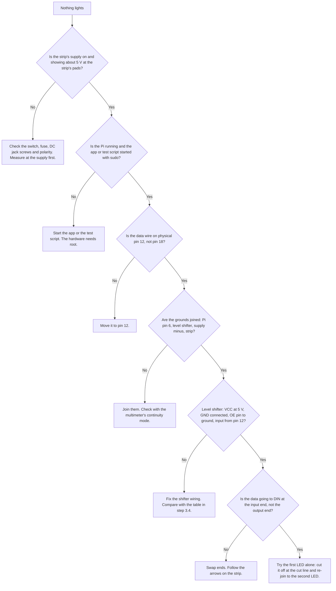

# 8. Troubleshooting and safety

Read the safety notes before you power anything on. Use the troubleshooting section when something doesn't look right.

## 8.1 Safety

### Mains electricity (the wall socket)

- **Never open a power supply, and never wire anything to mains.** Use enclosed plug-in supplies with the plug already fitted. Everything you handle in this guide is low voltage (5 V), and that is the safe part.
- Buy supplies that carry a safety mark for your country (CE, UKCA, UL or similar).
- **Switch off and unplug at the wall** before you touch any wiring, add a tap, or change a joint.
- Keep mains cables away from low-voltage wiring, and don't tie them into the same bundle.

### Heat and fire

- A strip that carries more current than its wiring allows gets hot. **Don't run all LEDs at full white for long.** The app has no brightness limit, so you are the limit.
- **Never cover a power supply or the Pi.** Leave air around them.
- **Fit the fuse.** A fuse is the thing that stops a short circuit from turning into a hot wire.
- After the first power-up and after any change, **feel** the supplies, fuse holders, lever nuts and joints after ten minutes. Warm is fine; too hot to hold is not. Switch off and find out why.
- If you smell hot plastic or see smoke, **switch off at the wall first, then investigate.**
- Don't leave the shelf powered and unattended until you've watched it run for a while.

### Short circuits

- A short circuit is +5 V touching ground. It can burn wires, kill the supply and damage the Pi.
- Insulate every exposed joint with heat-shrink or tape. Keep strands from fraying.
- Don't lay bare joints against metal.
- When probing with a multimeter, only touch the pad you mean to.
- The strip is **IP30**: not splash-proof. Keep it dry, and don't clean it with a wet cloth.

### Capacitors and soldering

- **Capacitors have a polarity.** Wrong way round, they can heat up and burst. Stripe to ground.
- A soldering iron burns skin and melts plastic. Use a stand. Work in a ventilated room and don't breathe the smoke. Wear safety glasses, and don't touch the tip even when it looks dull.
- Let solder joints cool before touching.

### The shelf

- A tall, loaded Kallax can tip. Pulling it away from the wall for the glow makes it a little less stable, and you have taken the back panel off. **Think about anchoring it** (this guide doesn't drill). Keep heavy things low.
- Don't let children climb on it.
- Keep cables out of walkways.

### Eyes

- LEDs are very bright up close. Don't stare into a bare strip at full power.

## 8.2 Troubleshooting

Start with the simplest checks, and change one thing at a time.

### Nothing lights

### Symptoms and fixes

| Symptom | Likely causes | What to try |
|---|---|---|
| **The first LED is the wrong colour** (others fine) | The data signal is marginal, or the first LED was hit by a voltage spike (no resistor, or no level shifter) | Check the level shifter and the 470 Ω resistor. If the first LED is damaged, cut it off at the cut line and re-join to the second LED. |
| **Flickering** | Ground not shared; a loose joint or breadboard wire; data wire too long; no capacitor; the supply is too weak | Check ground continuity first. Wiggle each joint and watch. Shorten the data wire. Check the capacitor is across the strip's power and the right way round. |
| **Random colours or random flashes** | No common ground; no level shifter; a floating data wire | Join the grounds. Add the level shifter and resistor. |
| **A brief flash when you switch on** | The strip's start-up | Usually harmless. If it is a lot of random colours, see the row above. |
| **Dark from LED n onwards** | Data stops at LED n (a dead LED, a bad joint, or a cut in the wrong place) | Check LED n and the joint just before it. Cut around a dead LED at the cut lines and re-join. |
| **Dark from the start of a row** | The jumper from the previous row is broken, backwards, or the row is wired DO to DO | Check the jumper with the multimeter, and the strip's direction arrow. |
| **A row lights but the whole row is dim, or turns yellow or red at the far end** | Voltage drop | Add a power tap at the other end of the row. Lower the brightness. See [step 4.3](04-floor-test.md#43-measure-the-voltage-at-the-far-end). |
| **The supply clicks on and off or switches off** | Overload (too many LEDs at full white) or a short | Switch off. Lower the brightness (use colours, not white). Check for shorts. Check the supply rating against [step 2.6](02-plan-your-layout.md#26-power-budget). |
| **The Pi crashes or reboots when the strip lights** | A power problem or a short through the Pi's ground | Check the Pi has its own supply and that the strip isn't powered from the Pi. Check grounds. |
| **The strip stays lit after the app is stopped** | The strip holds its last frame | Turn the lights off from the app first, or switch off at the power strip. |
| **The strip lights at start-up** | The app resumes the last scene when it starts | Normal. |
| **The wrong box lights** | The mapping, not the wiring | See [step 7](07-map-leds-to-boxes.md) ("If it's wrong"). |
| **A whole row lights in the wrong order** | Rows 2 and 4 run right to left | Remap that row. |
| **Everything is shifted** | The chain order isn't what you think: a piece is swapped or flipped | Check the labels on each piece and the jumper directions. |
| **The strip is hot** | Too much current, a poor joint or thin wire | Switch off. Find the hot spot. |
| **It works in the day, not at night (or the reverse)** | Probably a loose joint moving with temperature | Reflow or re-seat the joint. |
| **Smell of hot plastic** | See 8.1 | Switch off at the wall. |

### How to check things with the multimeter

| To find out | Mode | Probes | Good result |
|---|---|---|---|
| Is the supply 5 V? | DC volts | red on +, black on − at the supply | about 5.0 to 5.3 V |
| Is the strip getting power? | DC volts | at the strip's +5V and GND pads | about 5 V while lit (a small dip is fine) |
| Is a wire intact? | Continuity | both ends of the wire | beep |
| Is there a short? | Continuity | +5V and GND pads, unpowered | no beep |

## 8.3 When to stop

If something is hot, smells, sparks or a fuse blows, **stop**. Switch off at the wall and don't power it on again until you know why. A fuse that keeps blowing is telling you something is wrong; don't fit a bigger one.

Back to the [index](README.md).
